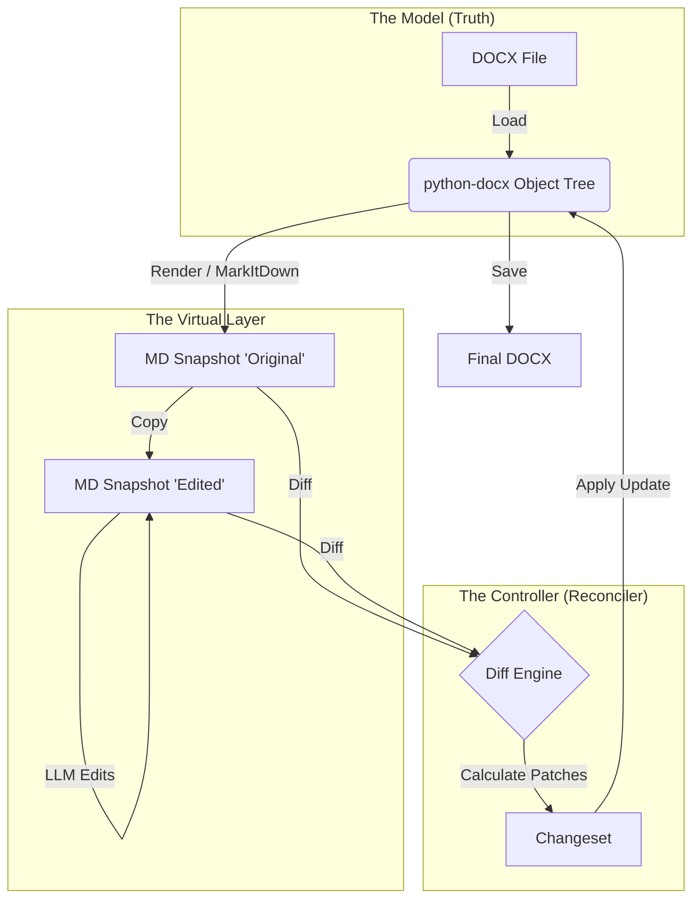

# Architecture: Document Reconciliation (Virtual DOM)

To handle the complexity of Word documents (`.docx`), Adeu uses a **Reconciler Pattern** inspired by React's Virtual DOM.

*   **The Real DOM**: The `python-docx` object tree (Heavy, XML-based, complex styles).
*   **The Virtual DOM**: A Markdown representation (Lightweight, semantic text, LLM-friendly).

## The Workflow

1.  **Render**: We project the Docx into Markdown (using MarkItDown) to create a "snapshot view" for the LLM.
2.  **Edit**: The LLM modifies the Markdown (The "Desired State").
3.  **Reconcile**: We diff the Desired State against the Original Snapshot to calculate specific patches (Updates/Inserts/Deletes).
4.  **Commit**: We apply only those patches to the original `python-docx` objects, preserving all surrounding formatting and metadata.

## Why this specific terminology works

*   **"Reconciliation"**: This is the precise computer science term for "making two conflicting models consistent."
*   **"Virtual DOM"**: Instantly communicates why we are doing this. It tells the reader: "We aren't converting formats; we are just using a lighter proxy to manage the heavy object."
*   **"Round-Tripping"**: Implies high fidelity: $A \to B \to A$.

## Formal Design Pattern Classification

This pattern is a composite of three classic GoF (Gang of Four) patterns:

1.  **The Memento Pattern**: You capture the internal state of the object (Docx) into an external format (Markdown) so you can restore or modify it later without violating encapsulation.
2.  **The Adapter Pattern**: You are adapting the interface of a Word Document (XML) to the interface expected by an LLM (Markdown).
3.  **The Visitor Pattern**: To generate the Markdown, your serializer "visits" every node in the Docx tree; to patch it back, the diff engine "visits" the nodes again to apply changes.

## Reconciliation Loop Diagram

